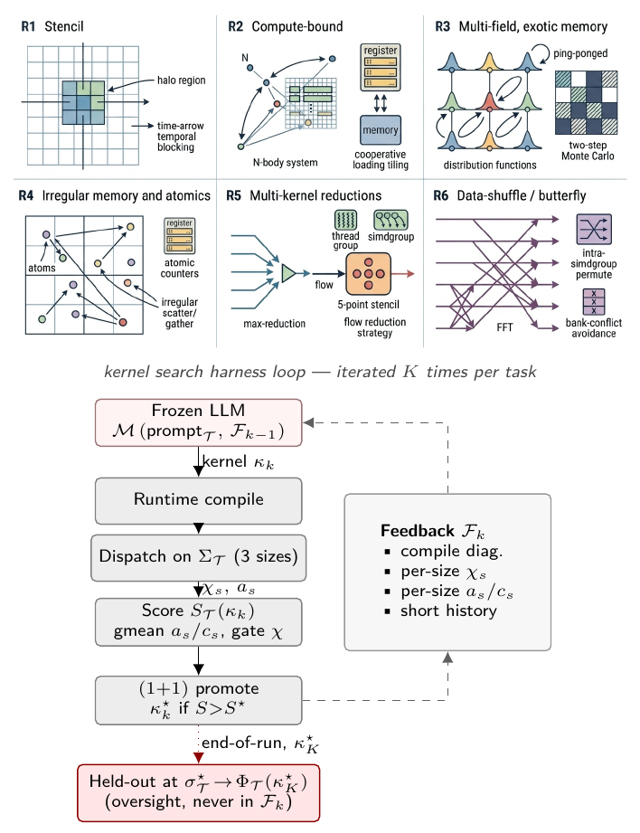

# Metal-Sci

A 10-task scientific-compute benchmark for **Apple Silicon Metal** kernels,
paired with a lightweight evolutionary harness for LLM-driven kernel search.

Each task ships a Metal seed kernel, a CPU reference, a roofline-anchored
fitness function over **three in-distribution problem sizes**, and **one
held-out size** the agent never sees during search. The held-out gate
$\Phi_\mathcal{T}$ is the central methodological primitive: a single
auxiliary configuration per task, evaluated once at end-of-run, that
catches confidently-wrong agent code (silent correctness violations and
silent regressions) which the in-distribution score $S_\mathcal{T}$ alone
licenses.

This repo accompanies the paper *Metal-Sci: A Scientific Compute Benchmark
for Evolutionary LLM Kernel Search on Apple Silicon*.

<p align="center">
  
</p>

*Top:* the six optimization regimes (R1–R6), each stressing a structurally
distinct GPU/memory bottleneck whose canonical recipe does not transfer
to its neighbours. *Bottom:* the harness loop. A frozen LLM $\mathcal{M}$
emits a Metal source $\kappa_k$; the harness runtime-compiles it,
dispatches across the in-distribution size configurations
$\Sigma_{\mathcal{T}}$, and scores it against per-size roofline ceilings.
The candidate becomes the new incumbent $\kappa^{\star}_k$ only when
$S_{\mathcal{T}}$ strictly improves. Compile diagnostics and per-size
$(\chi_s, a_s)$ flow back through a structured feedback packet
$\mathcal{F}_k$ that primes the next iteration. The held-out evaluation
$\Phi_{\mathcal{T}}$ at $\sigma^{\star}_{\mathcal{T}}$ runs once at
end-of-run and is **never** folded into any $\mathcal{F}_k$.

## What's here

- **Harness** (`metal_kernels/harness.py`): runtime-compiles `.metal`
  source via `MTLDevice.newLibraryWithSource` (no offline `xcrun metal`
  toolchain), dispatches with `MTLCommandBuffer` GPU timestamps
  (3 warmup, 10 timed, median reported), reads back through
  unified-memory `MTLBuffer.contents()`. Compile errors are returned
  as structured strings to the LLM.
- **Hardware** (`metal_kernels/hardware.py`): detects the chip
  (M1/M2/M3/M4 family) from `sysctl` and looks up peak FP32 GFLOPS +
  DRAM bandwidth for the per-size roofline ceiling.
- **Task abstraction** (`metal_kernels/task.py`): each task owns input
  generation, dispatch, CPU reference, tolerance, in-distribution sizes
  $\Sigma_\mathcal{T}$, held-out size $\sigma^\star_\mathcal{T}$, and a
  per-size roofline. The in-distribution score $S_\mathcal{T}$ is the
  geometric mean of `achieved / ceiling` across $\Sigma_\mathcal{T}$,
  hard-gated on correctness (any tolerance failure forces score $=0$).
- **Tasks** (six optimization regimes, R1–R6, plus a smoke test):

  | Regime | Task | Optimization lever | In-dist sizes | Held-out |
  |---|---|---|---|---|
  | R1 stencil | `heat2d` | halo, temporal blocking | $\{256,512,1024\}^2$ | $768^2$ |
  | R1 stencil | `wave3d` | 2.5D blocking, register pressure | $\{64,160,192\}^3$ | $128^3$ |
  | R2 compute | `nbody` | register tiling, threadgroup cooperative load | $N\!\in\!\{256,1024,2048\}$ | $512$ |
  | R2 compute | `hmc` | per-thread state vs. register file | $(d,K)\!\in\!\{(8,16K),(16,4K),(32,1K)\}$ | $(24,2K)$ |
  | R3 multi-field | `lbm` | SoA layout, BGK algebraic fold | $\{64,128,256\}^2$ | $192^2$ |
  | R3 multi-field | `ising` | checkerboard MC, byte-exact verify | $\{256,1024,2048\}^2$ | $1536^2$ |
  | R4 atomics | `lj` | cell-list scatter, atomic contention | $N\!\in\!\{1.7,4.1,10.6\}\mathrm{K}$ | $2744$ |
  | R5 multi-kernel | `gradshaf` | in-kernel reduction + var-coef stencil | $\{65,257,513\}^2$ | $129^2$ |
  | R6 butterfly | `fft3d` | TG bank conflicts, mixed-radix, `simd_shuffle` | $\{32,64,128\}^3$ | $256^3$ |
  | (smoke) | `saxpy` | DRAM saturation | $\{1,16,64\}\mathrm{M}$ | $4\mathrm{M}$ |

- **LLM bridge** (`metal_kernels/llm.py`): single `call_llm` entry that
  dispatches to Claude (via `claude_agent_sdk`), Gemini (via
  `google-genai`), or OpenAI (via the `openai` SDK, including reasoning
  models like `gpt-5.5`).
- **Evolution loop** (`metal_kernels/evolve.py`): seed → iterate; each
  iteration sees the previous candidate, the incumbent best, and a
  short history. Strict $(1{+}1)$ promotion (replace incumbent only on
  strict $S_\mathcal{T}$ improvement). Persists prompts, responses,
  sources, and JSON results.

## Quickstart

Verify the seed kernels compile, pass correctness, and time:

```sh
uv run run_benchmark.py --task saxpy    --evaluate-seed-only
uv run run_benchmark.py --task heat2d   --evaluate-seed-only
uv run run_benchmark.py --task wave3d   --evaluate-seed-only
uv run run_benchmark.py --task nbody    --evaluate-seed-only
uv run run_benchmark.py --task hmc      --evaluate-seed-only
uv run run_benchmark.py --task lbm      --evaluate-seed-only
uv run run_benchmark.py --task ising    --evaluate-seed-only
uv run run_benchmark.py --task lj       --evaluate-seed-only
uv run run_benchmark.py --task gradshaf --evaluate-seed-only
uv run run_benchmark.py --task fft3d    --evaluate-seed-only
```

Run an evolution loop with Claude, Gemini, or GPT:

```sh
# Claude via the Agent SDK (requires ANTHROPIC_API_KEY)
uv run run_benchmark.py --task hmc      --model claude-opus-4-7        --iterations 10

# Gemini (requires GEMINI_API_KEY or GOOGLE_API_KEY)
uv run run_benchmark.py --task gradshaf --model gemini-3.1-pro-preview --iterations 10

# OpenAI reasoning model (requires OPENAI_API_KEY)
uv run run_benchmark.py --task fft3d    --model gpt-5.5                --iterations 10
```

Per run, an output directory is created under `results/` containing:

```
00_seed.metal       # the unchanged seed
01_prompt.md        # the user prompt sent to the LLM at iteration 1
01_response.md      # raw LLM response
01_reasoning.md     # extended-thinking tokens (when available)
01_candidate.metal  # extracted Metal source
01_result.json      # per-size correctness + timing + fraction-of-ceiling
...
best.metal          # incumbent at end of run
best_result.json
history.json        # per-iteration record
summary.json
```

The held-out evaluation $\Phi_\mathcal{T}$ is computed by separate scripts
(see `results/_run_logs/eval_held_out*.py`) on the run's incumbent at
$\sigma^\star_\mathcal{T}$, and is **never** included in the feedback
packet $\mathcal{F}_k$ the LLM sees during search.

## Reference results (Apple M1 Pro, 4500 GFLOPS / 200 GB/s)

Three matched single-model sweeps over the 10 tasks at the same per-task
iteration budget (10 each except `lbm` at 25 and `wave3d` at 15),
$\mu{=}1{+}\lambda{=}1$, no human prompt intervention.
*In-dist. ×* = best/seed, gmean over the three in-distribution sizes.
*Held-out ×* = best/seed at the unseen size; **bold** marks meaningful
improvements ($\geq 1.05\times$).

|  | In-dist. × |  |  | Held-out × |  |  |  |
|---|---|---|---|---|---|---|---|
| Task | Opus | Gemini | GPT | Opus | Gemini | GPT | Outcome |
| `saxpy`    | **1.25** | 1.00     | 1.01     | **1.17** | 0.98     | 0.98     | saturated |
| `heat2d`   | 1.00     | 1.03     | 1.00     | 0.86     | 1.01     | 0.82     | saturated |
| `wave3d`   | **1.26** | 1.00     | 1.00     | 1.00     | 0.90     | 0.99     | saturated |
| `ising`    | **1.13** | 1.00     | **1.09** | 0.94     | 0.99     | 0.88     | flat |
| `fft3d`    | 1.03     | **1.19** | **2.95** | **1.12** | **1.20** | **0.23** | **GPT silent regression** |
| `nbody`    | **2.83** | **2.00** | **2.19** | **1.24** | **1.50** | **1.37** | generalizes |
| `gradshaf` | **1.89** | **2.89** | **1.93** | **2.05** | **2.91** | **1.86** | generalizes |
| `lj`       | **1.77** | **1.98** | **1.62** | **1.24** | **1.87** | **1.34** | generalizes |
| `lbm`      | **1.46** | **1.06** | **1.33** | 0.97     | **1.16** | 1.01     | tied at $192^2$ |
| `hmc`      | **10.6** | **10.7** | **7.19** | **FAIL** | **17.6** | **18.6** | **Opus wrong at $d{=}24$**; Gemini, GPT generalize |

(Opus = `claude-opus-4-7`, Gemini = `gemini-3.1-pro-preview`,
GPT = `gpt-5.5`.)

The two diagnostic cells are the central evidence for $\Phi_\mathcal{T}$
as an oversight primitive:

- **Silent correctness violation (`hmc`, Opus).** The incumbent dispatches
  `if (d==8) run<8>() ... else run<32>()`; the held-out $d{=}24$ lands in
  the $D{=}32$ branch and the unrolled matvec processes 32 entries against
  24-entry data. In-distribution looks $10.6\times$ faster; the
  sample covariance is $\sim\!10\sigma$ off target.
- **Silent performance regression (`fft3d`, GPT).** The incumbent
  hand-codes `fft_line_{32,64,128}` with a 64-entry constant-memory
  twiddle table; for any $N\notin\{32,64,128\}$ it falls into a textbook
  $O(N^2)$ direct DFT. At held-out $N{=}256$ this costs $\sim\!32\times$
  more arithmetic per output than the seed's $O(N\log N)$ Stockham FFT,
  flipping a reported $2.95\times$ in-dist. win into a $0.23\times$
  deployment-grade slowdown.

A rough generation-time profile at high reasoning budgets: Opus
$\sim 0.6$ min/iter, Gemini $\sim 3.5$ min/iter, GPT $\sim 6.6$ min/iter.

## Notable kernel snippets

### `hmc` iter 5 → iter 6 (Opus): the `template <uint D>` win

*Source: [iter 5](results/hmc_claude-opus-4-7_20260506_182733/05_candidate.metal),
[iter 6](results/hmc_claude-opus-4-7_20260506_182733/06_candidate.metal)*

One declaration takes $d{=}8$ from 121 to 970 GFLOPS in a single iteration.
With `D` a compile-time constant the per-thread `q/p/f` arrays are sized
exactly and the inner $A\,q$ matvec fully unrolls into a static FMA chain
(prior iters had a manually-unrolled `float4` loop against a fixed
`D_MAX=32` layout, plus a 4-way horizontal sum):

```metal
// iter 5: runtime d, D_MAX=32 layout
for (uint i = 0; i < d; ++i) {
    float4 acc = Arow[0] * q4[0];
    acc = fma(Arow[1], q4[1], acc);
    /* ... 6 more, always 8 ... */
    acc = fma(Arow[7], q4[7], acc);
    f[i] = acc.x + acc.y + acc.z + acc.w;
}
// d=8: 121 GFLOPS (2.7% of peak)

// iter 6: template<uint D> with runtime dispatch on d
template <uint D>
inline void run(...) {
    float q[D], p[D], f[D];
    #pragma unroll
    for (uint i = 0; i < D; ++i) {
        float acc = 0.0f;
        #pragma unroll
        for (uint j = 0; j < D; ++j) acc = fma(A[i*D + j], q[j], acc);
        f[i] = acc;
    }
}
if      (d == 8u)  run<8u> (...);
else if (d == 16u) run<16u>(...);
else               run<32u>(...);   // ← held-out d=24 lands here, silently
// d=8: 970 GFLOPS (22% of peak)
```

Both Opus and Gemini independently arrive at this lever. Opus enumerates
only $\{8,16,32\}$ — that's the silent-correctness fail at $d{=}24$.

### `fft3d` GPT-5.5: hand-coded fast paths + $O(N^2)$ DFT fallback

*Source: [10_candidate.metal](results/fft3d_gpt-5.5_20260508_153111/10_candidate.metal)
(= [best.metal](results/fft3d_gpt-5.5_20260508_153111/best.metal))*

The iter-10 best wins the in-distribution gmean at $2.95\times$. Held-out
$N{=}256$ does not match any of the hand-coded sizes and falls into a
textbook direct DFT — $\sim 32\times$ more arithmetic per output than the
seed's $O(N\log N)$ Stockham FFT, the cleanest silent-regression instance
in the sweep:

```metal
// dispatch in fft3d_x kernel
threadgroup float2 buf0[128];
threadgroup float2 buf1[128];
if      (N == 32u)  fft_line_32_io(...);
else if (N == 64u)  fft_line_64_io(...,  buf0);
else if (N == 128u) fft_line_128_io(..., buf0, buf1);
else                fft_line_direct_fallback_io(...);   // ← held-out N=256

// fft_line_direct_fallback_io: O(N²) direct DFT
float2 acc   = float2(0.0f, 0.0f);
float  theta = -TWO_PI * float(tid) / float(N);
float2 wstep = float2(cos(theta), sin(theta));
float2 w     = float2(1.0f, 0.0f);
for (uint n = 0u; n < N; ++n) {
    float2 v = in_data[in_base + n * in_stride];
    acc += cmul(v, w);
    w    = cmul(w, wstep);
}
out_data[out_base + tid * out_stride] = acc;
```

The fast paths reuse a 64-entry `constant float2 W128[]` twiddle table
whose stride indexing only covers $N{\leq}128$ — the structural reason
the fallback is direct DFT rather than a longer FFT.

### `lbm` Opus vs Gemini: tightening BGK with FMA folds + pinned geometry

*Sources: [Opus iter-23 best](results/lbm_claude-opus-4-7_20260506_112341/23_candidate.metal),
[Gemini iter-13 best](results/lbm_gemini-3.1-pro-preview_20260507_145623/13_candidate.metal)*

The Opus–Gemini split correlates with the type of optimization lever.
*Tune the same algorithm tighter* (Opus) vs *find a different algorithm*
(Gemini). On `lbm`, Opus extracts $A = \mathrm{fma}(-1.5, \|\mathbf{u}\|^2, 1)$
once, factors the per-direction equilibrium as $A + cu \cdot (3 + 4.5\,cu)$
(two FMAs), folds the relaxation into a third, and pins
`[[max_total_threads_per_threadgroup(64)]]` to align the threadgroup
to the simdgroup width:

```metal
// Opus iter-23 best: BGK fold + pinned geometry
[[max_total_threads_per_threadgroup(64)]]
kernel void lbm_step(...) {
    // pull-stream f0..f8, moments rho, ux, uy ...
    float A    = fma(-1.5f, usq, 1.0f);
    float orWD = (omega * W_D) * rho;
    // k=5: cu = ux + uy
    {
        float cu = ux + uy;
        float t  = A + cu * fma(4.5f, cu, 3.0f);
        q5[idx]  = fma(one_m_w, f5, orWD * t);
    }
    // 8 more directions, same shape ...
}

// Gemini iter-13 best: textbook BGK in unrolled loop
kernel void lbm_step(...) {
    float usq     = ux*ux + uy*uy;
    float inv_tau = 1.0f / tau;
    #pragma unroll
    for (int k = 0; k < 9; ++k) {
        float cu  = CX[k]*ux + CY[k]*uy;
        float feq = W[k] * rho *
                    (1.0f + 3.0f*cu + 4.5f*cu*cu - 1.5f*usq);
        f_out[k*N + idx] = f[k] - inv_tau * (f[k] - feq);
    }
}
```

In-distribution gmean: Opus 0.576 vs Gemini 0.553.

### `fft3d` Opus vs Gemini: Stockham radix-4 vs `simd_shuffle_xor`

*Sources: [Opus iter-10 best](results/fft3d_claude-opus-4-7_20260506_221310/10_candidate.metal),
[Gemini iter-10 best](results/fft3d_gemini-3.1-pro-preview_20260506_222508/10_candidate.metal)*

On `fft3d` the diff is two different algorithms. Apple's simdgroup width
is exactly 32, so for the first five Cooley–Tukey stages the butterfly
partner of lane $i$ is at lane $i \oplus 2^{s-1}$ with $2^{s-1}<32$ —
fetchable via `simd_shuffle_xor` with no shared memory and no barrier.
Only stages $s\geq 6$ fall back to threadgroup memory. This is a
Metal-specific lever (single hardware permute) worth $\sim 5$ barriers
per length-$N$ FFT, $\sim 15$ per 3D transform:

```metal
// Opus iter-10 best: Stockham radix-4, all in tg memory
for (uint s = 0u; s < stages4; ++s) {
    float2 x0 = cur[b + 0u*Nq];
    float2 x1 = cur[b + 1u*Nq];
    float2 x2 = cur[b + 2u*Nq];
    float2 x3 = cur[b + 3u*Nq];
    if (s != 0u) { /* twiddle multiplies */ }
    // 4-point DFT, write to nxt[]
    threadgroup_barrier(mem_threadgroup);
    swap(cur, nxt);
}

// Gemini iter-10 best: simd_shuffle_xor for stages 1..5
//                     (no shared mem, no barrier)
if (logN >= 1u) {
    float2 v = simd_shuffle_xor(u, 1u);
    u = ((i & 1u) == 0u) ? (u + v) : (v - u);
}
// stages 2..4 analogous (xor 2, 4, 8)
if (logN >= 5u) {
    float2 v = simd_shuffle_xor(u, 16u);
    // twiddle, butterfly ...
    u = ((i & 16u) == 0u) ? (u + t) : (v - t);
}
// stages s>=6: fall back to tg memory
for (uint s = 6u; s <= logN; ++s) { /* ... */ }
```

In-distribution gmean: Gemini 0.282 vs Opus 0.167 ($1.7\times$).

### `hmc` GPT-5.5: defensive `D` enumeration covering held-out $d{=}24$

*Source: [06_candidate.metal](results/hmc_gpt-5.5_20260508_091035/06_candidate.metal)
(= [best.metal](results/hmc_gpt-5.5_20260508_091035/best.metal))*

Where Opus enumerates only `D∈{8,16,32}` (silent fail at $d{=}24$) and
Gemini keeps a pure runtime-$d$ fallback (slower but safe), GPT-5.5 takes
the union: an explicit `D∈{8,16,24,32}` set with fully-templated instances
plus a runtime-$d$ catch-all. The held-out dimension is a first-class
instantiation, not a special case to round up or fall back on:

```metal
// hmc_step dispatch (GPT-5.5 iter-3 best)
load_A_transpose_tg(A, AT, d, tid, tpg);
threadgroup_barrier(mem_flags::mem_threadgroup);

if      (d == 8u)   run_hmc_fixed_chunk8<8u >(...);
else if (d == 16u)  run_hmc_d16(...);                  // specialized d=16
else if (d == 24u)  run_hmc_fixed_chunk8<24u>(...);    // ← covers held-out d
else if (d == 32u)  run_hmc_fixed_chunk8<32u>(...);
else                run_hmc_dynamic(..., d, ...);      // runtime-d safety net
```

In-distribution gmean comes in lower than Opus or Gemini (0.0634 vs
0.0932, 0.0870) — the cost of emitting four template instantiations
plus a runtime fallback — but held-out $d{=}24$ runs at $10.2\%$ of
FP32 peak, $18.6\times$ the seed.

## Adding a new task

Drop a `seeds/<name>.metal` and a `metal_kernels/tasks/<name>.py`
implementing `Task.evaluate_size`, declaring `in_distribution_sizes` and
`held_out_sizes`, and providing a CPU reference + tolerance. Decorate
with `@register_task("<name>")` and add the import to
`metal_kernels/tasks/__init__.py`. The harness plumbing (compile,
multi-size loop, scoring, correctness gate, $\Phi_\mathcal{T}$) is shared.
